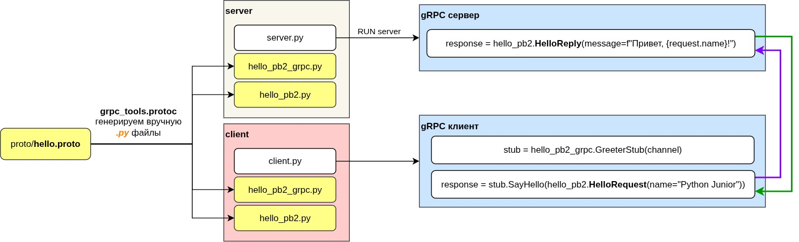

# grpc-protobuf-example
Полный гайд: gRPC + ProtoBuf + Python + Docker

Пример проекта на Python с использованием **gRPC** и **ProtoBuf**.  
Проект включает сервер и клиент, которые обмениваются простыми сообщениями: клиент отправляет имя, сервер возвращает приветствие.




## Структура репозитория

| Путь | Назначение |
|---|---|
| `proto/hello.proto` | Описание ProtoBuf: сообщения `HelloRequest`, `HelloReply` и сервис `Greeter` с методом `SayHello`. |
| `server/` | Код сервера. |
| `server/hello_pb2.py` | Сгенерированные классы сообщений (из `.proto`) для сервера. |
| `server/hello_pb2_grpc.py` | Сгенерированный код для сервиса, абстрактный класс сервиса и функции регистрации. |
| `server/server.py` | Основной сервер: реализация сервиса, запуск gRPC-сервера, логирование. |
| `client/` | Код клиента. |
| `client/hello_pb2.py` | Сгенерированные сообщения для клиента. |
| `client/hello_pb2_grpc.py` | Сгенерированные stub-классы для вызова методов сервера. |
| `client/client.py` | Основной клиент: создаёт канал, stub, отправляет запрос и логирует ответ. |
| `requirements.txt` | Python-зависимости проекта (`grpcio`, `grpcio-tools`, `protobuf`). |
| `Dockerfile` | Инструкция сборки Docker-образа для сервера/клиента. |
| `docker-compose.yml` | Конфигурация Docker Compose для запуска серверa и клиента с сетью. |
| `.gitignore` | Игнорирование временных файлов, `venv/`, `__pycache__/` и др. |
| `README.md` | Документация и инструкция запуска проекта. |


# venv
```
python3 -m venv venv
source venv/bin/activate
pip install --upgrade pip
pip install --no-cache-dir -r requirements.txt
```

# Генерация Python-кода из .proto
Запускаем команду (можно внутри контейнера или на своей машине):
```
python -m grpc_tools.protoc -I=./proto --python_out=./server --grpc_python_out=./server ./proto/hello.proto
python -m grpc_tools.protoc -I=./proto --python_out=./client --grpc_python_out=./client ./proto/hello.proto
```

Каждая команда сгенерирует по 2 файла в двух разных директориях `./client` и `./server` (2 файла в client идентичны 2м файлам в server).

# Запускаем локально (без Docker) сервер и клиент на разных портах

## Запускаем сервер
```
python server/server.py
```
В консоли получим результат:
```
[SERVER] gRPC сервер запущен на порту 50051
```

## Запускаем клиент (уйдет запрос к серверу)
Для клиента в файле `client/client.py` нужно в переменной `host` установить нужное значение:
- 'localhost' - если запуск будет производиться локально (без Docker)
- 'server' - для использования с Docker

```
host='localhost'
```

Запускаем клиент командой:
```
python client/client.py
```

## Лог сервера и клиента
Сервер даст ответ на каждый запуск клиента:
```
[SERVER] Получен запрос: name=Python Junior
[SERVER] Отправляем ответ: Привет, Python Junior!
```

Клиент выведет в консоль при каждом запуске:
```
[CLIENT] Создаём канал к серверу...
[CLIENT] Stub создан. Отправляем запрос...
[CLIENT] Получен ответ: Привет, Python Junior!
```

# Запуск с докером
Собираем контейнеры с помощью команды:
```
docker compose build
```

Результат:
```
[+] Building 2/2
 ✔ client  Built
 ✔ server  Built 
```

Запускаем контейнеры
```
docker compose up
```

# Результат

```
[+] Running 3/3
 ✔ Network grpc-protobuf-example_custom_net  Created                                                                            0.1s 
 ✔ Container grpc_server                     Created                                                                            0.2s 
 ✔ Container grpc_client                     Created                                                                            0.2s 
Attaching to grpc_client, grpc_server
grpc_server  | [SERVER] gRPC сервер запущен на порту 50051
grpc_client  | [CLIENT] Создаём канал к server:50051...
grpc_client  | [CLIENT] Stub создан. Отправляем запрос...
grpc_server  | [SERVER] Получен запрос: name=Python Junior
grpc_server  | [SERVER] Отправляем ответ: Привет, Python Junior!
grpc_client  | [CLIENT] Получен ответ: Привет, Python Junior!
```

## Полезные команды docker compose
### Остановить сервисы и удалить контейнеры
```
docker compose down
```

### Удалить контейнеры + сети + volumes проекта
```
docker compose down -v
```

### Удалить контейнеры + сети + volumes + собранные образы
```
docker compose down --rmi all -v
```
